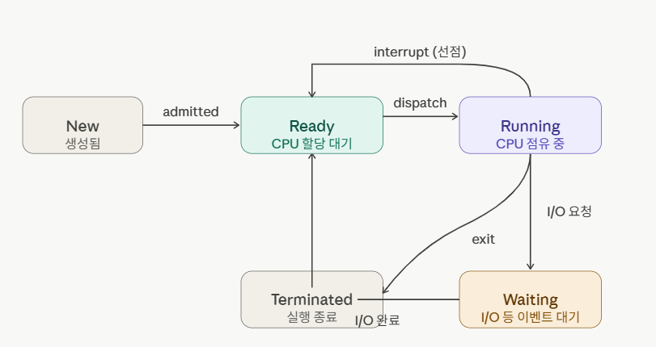

# 1. 프로세스와 스레드

## ✅ 프로세스(Process)

프로세스란, 실행중인 프로그램으로, 디스크로부터 메모리에 적재되어 CPU 할당을 받을 수 있다. OS로부터 주소공간, 파일, 메모리 등을 할당받고 이를 통틀어 프로세스라고 정의한다.

프로세스는 함수의 매개변수, 복귀주소, 로컬 변수와 같은 임시 자료를 갖는 스택과 전역변수를 저장하는 데이터를 포함하며, 프로세스 실행 중 동적으로 할당되는 메모리인 힙을 포함한다.
위 용어들은 컴퓨터 구조에 관한 용어로, 해당 부분은 [1. 컴퓨터 구조 기초](../Computer-Architecture/1_컴퓨터구조_기초.md) 를 참고하면 된다.

<br>

### 프로세스 제어 블록 (Process Control Block, PCB)

PCB는 특정 프로세스에 대한 중요한 정보를 저장하고 있는 운영체제의 자료구조이다. 여기서 중요한 정보라함은 다음과 같다.

- 프로세스 식별자 (PID) : 프로세스 식별 번호
- 프로세스 상태 : new, ready, running, waiting, terminated 등 상태
- 프로그램 카운터 : 프로세스가 다음에 실행할 명령어의 주소
- CPU 레지스터
- CPU 스케줄링 정보 : 페이지 테이블이나 세그먼트 테이블 등 정보 포함
- 입출력 상태 정보 : 프로세스에 할당된 입출력 장치들과 열린 파일 목록
- 어카운팅 정보 : 사용된 CPU시간, 시간제한, 계정 번호 등

운영체제는 프로세스를 관리하기 위해 프로세스의 생성과 동시에 **고유한 PCB**를 생성한다. 프로세스는 CPU를 할당받아 작업하다가 전환이 발생하면 진행하던 작업을 저장하고 CPU를 반환하는데, 이때 진행상황이 모두 PCB에 저장된다. 다시 CPU를 할당받아 작업을 시작하게 되면 PCB에 저장되어있던 내용들을 불러와 종료 시점부터 다시 작업을 시작할 수 있다.

<br>

> **🔗 프로세스 상태 전이도**
>
> 
>
> - **New** : 프로세스가 막 생성된 상태. OS가 PCB를 만들고 초기화하는 시점
> - **Ready** : CPU를 받을 준비는 되었으나 아직 순서가 안 된 상태. Ready Queue에서 대기
> - **Running** : CPU를 할당받아 실행중인 상태.
> - **Waiting** : I/O 작업이나 특정 이벤트가 완료될 때까지 Device queue에서 기다리는 상태
> - **Terminated** : 실행이 끝난 상태, PCB는 메모리에 남아있다가 OS가 정리함
>
> **Running -> ready**는 강제로 뺴앗기는 것(**선점형**)
> **Running -> waiting**은 프로세스가 스스로 포기하는 것

<br>

## ✅ 스레드 (Thread)

스레드는 프로세스의 실행 단위라고 할 수 있다. 하나의 프로세스에서 동작하는 여러 실행 흐름으로 프로세스 내 주소 공간이나 자원을 공유한다. 스레드는 스레드 ID, *프로그램 카운터, *레지스터 집합, 스택으로 구성되며, 같은 프로세스 내 다른 스레드와 code, data 섹션, 운영체제 자원들을 공유한다.
메모리 중 code, data, heap은 공유하지만 **stack은 독립적으로 사용**한다.

Stack에는 함수의 지역변수, 매개변수, 반환 주소를 저장하기 때문에, 독립적으로 사용해야 독립적인 함수 호출이 가능하다.

> **\*프로그램 카운터 (PC)**
>
> 현재 실행중인 명령어의 주소를 저장하는 레지스터
>
> **\*레지스터 집합**
>
> 레지스터란, CPU 안에 있는 아주 작고 빠른 임시 저장공간이다. 연산할 때 메모리에서 값을 바로 쓰는게 아니라 레지스터에 올려두고 계산한다.
>
> 이 PC와 Register set도 스레드마다 독립적으로 갖는다. (실행 흐름과 연산 중간값이 다르기 때문)

### 스레드 제어 블록 (Thread Control Block, TCB)

스레드를 전환해야 할 때 PCB처럼 TCB가 존재해서 이 곳에 **PC, 레지스터 집합, 스택포인터** 등의 스레드 정보를 저장한다.

즉, 스레드간 독립적으로 가져야 하는 요소들을 저장한다.

PCB와 TCB는 아래 그림처럼 PCB가 TCB를 품는 구조가 된다.

```
PCB (프로세스 정보)
├── 메모리 정보 (code, data, heap 위치)
├── 열린 파일 목록
├── TCB - Thread1 (PC, 레지스터, 스택)
├── TCB - Thread2 (PC, 레지스터, 스택)
└── TCB - Thread3 (PC, 레지스터, 스택)
```

#### **Context Switching 비교**

메모리 정보는 프로세스 단위로 존재하기 때문에 프로세스 간 전환은 상대적으로 비용이 크고, 스레드간 전환은 메모리 공간은 그대로고 TCB만 교체되기 때문에 비용이 훨씬 작다.
